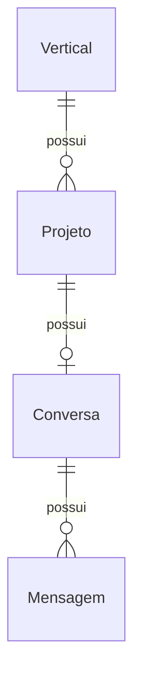
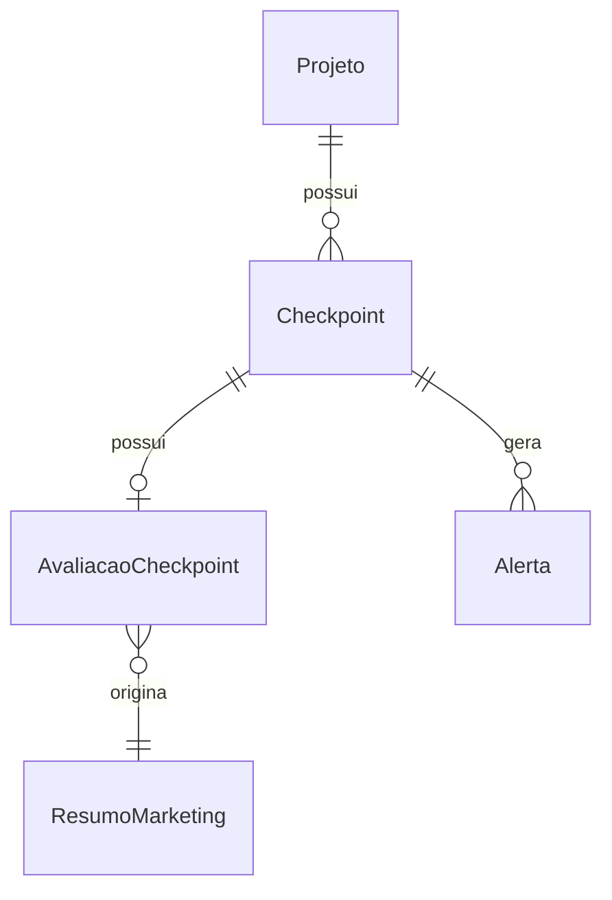

# Regras de Negócio — Projeto Farol

Este documento registra as regras de negócio confirmadas pelo time de business que orientam a modelagem e implementação do sistema.

---

## 1. Criação Mínima do Projeto

Um projeto é criado por um colaborador de uma vertical. Para criar o projeto, os únicos dados **obrigatórios** são:

- **Título/Nome** do projeto
- **Vertical** responsável
- **Breve descrição**

O status inicial de todo novo projeto é **EM_IDEACAO**.

---

## 2. Conversa Principal

- Todo projeto possui **uma conversa principal**, exclusiva daquele projeto.
- A conversa contém várias mensagens e funciona como **memória contínua do projeto**.
- A tabela `conversas` possui `unique constraint` em `projeto_id`.
- A conversa bruta é **privada**.

**Quem acessa a conversa bruta:**
- O criador do projeto
- Usuários autorizados da própria vertical (conforme política vigente)
- O agente de IA (futuro)

**Quem NÃO acessa:**
- Marketing
- Liderança

Eles receberão futuramente apenas **resumos estruturados dos checkpoints**.

---

## 3. Status do Projeto vs Classificação Farol

O projeto possui um **status geral** (`StatusProjeto`), **separado** da classificação Farol do checkpoint (`ClassificacaoFarol`).

### Status Gerais do Projeto

| Status | Descrição |
|--------|-----------|
| `EM_IDEACAO` | Projeto em fase de ideação (status inicial) |
| `EM_DESENVOLVIMENTO` | Projeto em desenvolvimento |
| `AGUARDANDO_PRE_LANCAMENTO` | Aguardando checkpoint de pré-lançamento |
| `APROVADO_PARA_LANCAMENTO` | Aprovado para lançamento |
| `LANCADO` | Projeto lançado |
| `EM_ALERTA` | Situação temporária: existe alerta ativo aguardando decisão humana |
| `ENCERRADO` | Projeto encerrado |

### Mapeamento de Status Antigos (Migração)

| Status Antigo | Status Novo |
|---------------|-------------|
| RASCUNHO | EM_IDEACAO |
| IDEACAO | EM_IDEACAO |
| DESENVOLVIMENTO | EM_DESENVOLVIMENTO |
| PRE_LANCAMENTO | AGUARDANDO_PRE_LANCAMENTO |
| APROVADO | APROVADO_PARA_LANCAMENTO |
| ADAPTACAO_SOLICITADA | EM_ALERTA |
| ENCERRADO | ENCERRADO |
| LANCADO | LANCADO |

---

## 4. Três Checkpoints Obrigatórios

O sistema possui exatamente três checkpoints, definidos pelo enum `TipoCheckpoint`:

1. **IDEACAO** — Ideação
2. **DESENVOLVIMENTO** — Desenvolvimento
3. **PRE_LANCAMENTO** — Pré-lançamento

A estrutura normalizada de `Checkpoint` é mantida. **Não** existem campos booleanos redundantes como `checkpoint_1_completo`, etc. A conclusão é determinada consultando os três registros de checkpoint e seus respectivos `StatusCheckpoint` (especialmente `CONCLUIDO`).

---

## 5. Avaliação de Checkpoint

Cada checkpoint possui **no máximo uma avaliação** (`AvaliacaoCheckpoint`), que armazena:

- Score de alinhamento (0–100)
- Score de potencial (0–100)
- Critérios individuais de alinhamento (JSON)
- Critérios individuais de potencial (JSON)
- Explicações e feedbacks (JSON)
- Classificação Farol (`PRIORIDADE_MAXIMA`, `VALE_INVESTIR_TEMPO`, `BAIXA_PRIORIDADE`)

Os thresholds de decisão (alinhamento alto >= 70, potencial alto >= 60) **não** são implementados nesta tarefa — pertencem à futura sprint de checkpoints e avaliações.

---

## 6. Alertas

- Alerta pertence a um **projeto**
- Pode opcionalmente pertencer a um **checkpoint**
- Possui **decisão humana** (`DecisaoHumana`: `SOLICITAR_ADAPTACAO`, `ENCERRAR_PROJETO`, `PERMITIR_CONTINUIDADE`)
- Possui **usuário responsável** pela decisão (`decidido_por_id`)
- Possui **data da decisão** (`decidido_em`)

**Regra fundamental**: A decisão final **sempre** é humana. A IA **nunca** pode:
- Aprovar lançamento
- Encerrar projeto
- Solicitar adaptação como decisão final
- Modificar status final por conta própria

---

## 7. Pré-condição para Aprovação de Lançamento

O projeto só poderá ser aprovado para lançamento (`APROVADO_PARA_LANCAMENTO`) quando **os três checkpoints** estiverem com status **CONCLUIDO**.

Esta regra será implementada em uma sprint futura.

---

## 8. Regras Deixadas para Sprints Futuras

- CRUD de projetos
- Endpoints de conversa/envio de mensagens
- Integração com IA
- Resposta automática do agente
- Sugestões de checkpoint
- Formulários
- Cálculo de scores
- Matriz Farol
- Notificações
- Pipeline de decisão humana (aprovação/rejeição/adaptação)
- Dashboard
- Frontend
- Auditoria

---

## 9. Diagramas Mermaid

### 9.1 Vertical → Projeto → Conversa → Mensagens

### 9.2 Projeto → Checkpoints → Avaliação → Resumo para Marketing

---

## 10. Decisões Arquiteturais Relacionadas

1. **UUID como chave primária**: evita exposição de sequenciais, facilita migrações e integrações futuras
2. **Timestamps com timezone**: todas as datas armazenadas com fuso horário para consistência entre fusos
3. **Valores gerados no banco**: `created_at` e `updated_at` usam `server_default=func.now()`
4. **Naming convention**: constraint names seguem padrão `{tipo}_{tabela}_{coluna(s)}` (ex.: `fk_projetos_vertical_id_verticals`)
5. **Cascade mínimo**: não há cascade perigoso; checkpoints são deletados com o projeto, mas alertas e conversas mantêm referência
6. **Check constraints no modelo**: `AvaliacaoCheckpoint` valida scores 0–100 via `CheckConstraint` nativo do banco
7. **Privacidade das conversas**: o modelo não cria relacionamento direto entre Marketing e Mensagens; o controle será feito em camada de serviço
8. **Migração reversível**: a mudança do enum `StatusProjeto` foi feita via migração Alembic reversível (0002), preservando dados existentes

---

*Documento atualizado na Sprint 4.5 — Alinhamento do Domínio com as Regras do Business*