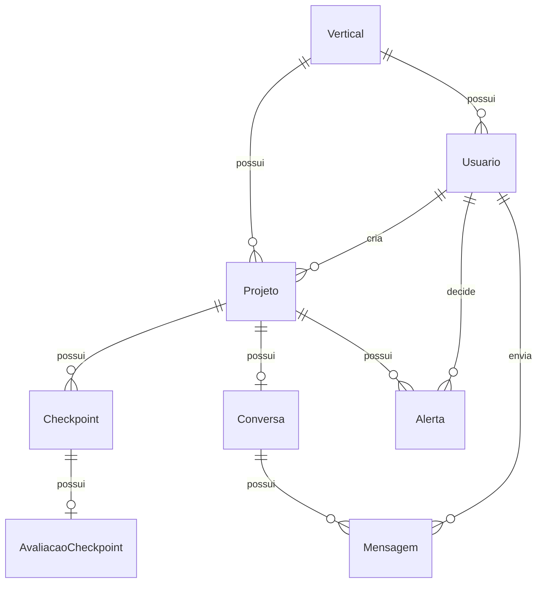

# Modelo de Dados — Projeto Farol

## Diagrama Entidade-Relacionamento

## Entidades

### 1. Vertical

Representa uma área da empresa (ex.: Viagens, Conecta, Fidelidade).

| Campo | Tipo | Restrições |
|---|---|---|
| id | UUID | PK |
| nome | string(100) | unique, not null |
| descricao | text | opcional |
| ativa | boolean | default true |
| created_at | datetime(tz) | not null |
| updated_at | datetime(tz) | not null |

**Relacionamentos**
- Uma Vertical possui vários Usuários
- Uma Vertical possui vários Projetos

---

### 2. Usuário

Representa um usuário da plataforma.

| Campo | Tipo | Restrições |
|---|---|---|
| id | UUID | PK |
| nome | string(200) | not null |
| email | string(255) | unique, not null |
| senha_hash | string(255) | not null |
| papel | PapelUsuario | enum, not null |
| vertical_id | UUID | FK → Vertical, opcional |
| ativo | boolean | default true |
| created_at | datetime(tz) | not null |
| updated_at | datetime(tz) | not null |

**PapelUsuario**: `VERTICAL`, `MARKETING`, `LIDERANCA`, `ADMIN`

**Regras**
- Usuários `VERTICAL` normalmente pertencem a uma Vertical
- Usuários `MARKETING`, `LIDERANCA` ou `ADMIN` podem não possuir Vertical
- Autenticação será implementada em sprint futura

**Relacionamentos**
- Pertence a uma Vertical (opcional)
- Cria vários Projetos

---

### 3. Projeto

Representa um projeto criado por uma Vertical.

| Campo | Tipo | Restrições |
|---|---|---|
| id | UUID | PK |
| titulo | string(200) | not null |
| descricao | text | opcional |
| objetivo | text | opcional |
| vertical_id | UUID | FK → Vertical, not null |
| criado_por_id | UUID | FK → Usuário, not null |
| status | StatusProjeto | enum, default RASCUNHO |
| created_at | datetime(tz) | not null |
| updated_at | datetime(tz) | not null |

**StatusProjeto**: `RASCUNHO`, `IDEACAO`, `DESENVOLVIMENTO`, `PRE_LANCAMENTO`, `APROVADO`, `ADAPTACAO_SOLICITADA`, `ENCERRADO`, `LANCADO`

**Relacionamentos**
- Pertence a uma Vertical
- Possui um criador (Usuário)
- Possui vários Checkpoints
- Possui no máximo uma Conversa
- Possui vários Alertas

---

### 4. Checkpoint

Representa uma etapa de avaliação do projeto (Ideação, Desenvolvimento, Pré-lançamento).

| Campo | Tipo | Restrições |
|---|---|---|
| id | UUID | PK |
| projeto_id | UUID | FK → Projeto, not null |
| tipo | TipoCheckpoint | enum, not null |
| status | StatusCheckpoint | enum, default PENDENTE |
| sugerido_em | datetime(tz) | opcional |
| iniciado_em | datetime(tz) | opcional |
| concluido_em | datetime(tz) | opcional |
| respostas_formulario | JSON | opcional |
| resumo_para_marketing | text | opcional |
| created_at | datetime(tz) | not null |
| updated_at | datetime(tz) | not null |

**TipoCheckpoint**: `IDEACAO`, `DESENVOLVIMENTO`, `PRE_LANCAMENTO`

**StatusCheckpoint**: `PENDENTE`, `SUGERIDO`, `EM_PREENCHIMENTO`, `CONCLUIDO`

**Constraints**
- Unique (projeto_id, tipo): cada projeto só pode ter um checkpoint de cada tipo
- A regra de ordem entre os checkpoints será implementada em sprint futura

---

### 5. Avaliação de Checkpoint

Armazena o resultado da avaliação de um checkpoint.

| Campo | Tipo | Restrições |
|---|---|---|
| id | UUID | PK |
| checkpoint_id | UUID | FK → Checkpoint, unique, not null |
| score_alinhamento | integer | opcional, 0–100 |
| score_potencial | integer | opcional, 0–100 |
| classificacao_farol | ClassificacaoFarol | enum, opcional |
| criterios_alinhamento | JSON | opcional |
| criterios_potencial | JSON | opcional |
| explicacoes | JSON | opcional |
| created_at | datetime(tz) | not null |
| updated_at | datetime(tz) | not null |

**ClassificacaoFarol**: `PRIORIDADE_MAXIMA`, `VALE_INVESTIR_TEMPO`, `BAIXA_PRIORIDADE`

**Constraints**
- `checkpoint_id` é unique: cada checkpoint tem no máximo uma avaliação
- `score_alinhamento` deve estar entre 0 e 100 quando preenchido (CHECK)
- `score_potencial` deve estar entre 0 e 100 quando preenchido (CHECK)

---

### 6. Alerta

Registra alertas gerados durante a avaliação dos checkpoints.

| Campo | Tipo | Restrições |
|---|---|---|
| id | UUID | PK |
| projeto_id | UUID | FK → Projeto, not null |
| checkpoint_id | UUID | FK → Checkpoint, opcional |
| tipo | TipoAlerta | enum, not null |
| titulo | string(200) | not null |
| motivo | text | not null |
| status | StatusAlerta | enum, default ABERTO |
| decisao_humana | DecisaoHumana | enum, opcional |
| decidido_por_id | UUID | FK → Usuário, opcional |
| decidido_em | datetime(tz) | opcional |
| created_at | datetime(tz) | not null |
| updated_at | datetime(tz) | not null |

**TipoAlerta**: `COMPLIANCE_LEGAL`, `REPUTACAO_MARCA`, `POSSIVEL_DUPLICACAO`, `CUSTO_DESPROPORCIONAL`, `OUTRO`

**StatusAlerta**: `ABERTO`, `EM_ANALISE`, `RESOLVIDO`, `DESCARTADO`

**DecisaoHumana**: `SOLICITAR_ADAPTACAO`, `ENCERRAR_PROJETO`, `PERMITIR_CONTINUIDADE`

**Regra**: a decisão final deve ser sempre humana. A IA nunca deve ser representada como responsável pela decisão.

---

### 7. Conversa

Conversa entre a Vertical e o agente de IA. Privada — o Marketing não tem acesso às mensagens originais.

| Campo | Tipo | Restrições |
|---|---|---|
| id | UUID | PK |
| projeto_id | UUID | FK → Projeto, unique, not null |
| created_at | datetime(tz) | not null |
| updated_at | datetime(tz) | not null |

**Regras**
- Um projeto possui no máximo uma conversa principal
- A privacidade será implementada via serviços e permissões em sprints futuras

---

### 8. Mensagem

Mensagem individual dentro de uma conversa.

| Campo | Tipo | Restrições |
|---|---|---|
| id | UUID | PK |
| conversa_id | UUID | FK → Conversa, not null |
| autor_tipo | AutorMensagem | enum, not null |
| usuario_id | UUID | FK → Usuário, opcional |
| conteudo | text | not null |
| created_at | datetime(tz) | not null |

**AutorMensagem**: `USUARIO`, `AGENTE`, `SISTEMA`

**Observação**: Mensagens não possuem `updated_at` — são imutáveis após criadas.

---

## Decisões Arquiteturais

1. **UUID como chave primária**: evita exposição de sequenciais, facilita migrações e integrações futuras
2. **Timestamps com timezone**: todas as datas armazenadas com fuso horário para consistência entre fusos
3. **Valores gerados no banco**: `created_at` e `updated_at` usam `server_default=func.now()`; `updated_at` também usa `onupdate=func.now()`
4. `from sqlalchemy import Enum as SQLEnum`: evita conflito de nomes com `enum.Enum` / `enum.StrEnum`
5. **Naming convention**: constraint names seguiram padrão `{tipo}_{tabela}_{coluna(s)}` (ex.: `fk_usuarios_vertical_id_verticals`)
6. **Cascade mínimo**: não há cascade perigoso; checkpoints são deletados com o projeto, mas alertas e conversas mantêm referência
7. **Check constraints no modelo**: `AvaliacaoCheckpoint` valida scores 0–100 via `CheckConstraint` nativo do banco
8. **Privacidade das conversas**: o modelo não cria relacionamento direto entre Marketing e Mensagens; o controle será feito em camada de serviço

## Pontos para Sprints Futuras

- [ ] Implementar autenticação e autorização (JWT, roles)
- [ ] Endpoints CRUD para todas as entidades
- [ ] Regra de ordem obrigatória entre checkpoints (Ideação → Desenvolvimento → Pré-lançamento)
- [ ] Cálculo real dos scores de alinhamento e potencial
- [ ] Geração de alertas automáticos
- [ ] Chat com agente de IA
- [ ] Resumos formais para Marketing
- [ ] Notificações
- [ ] Pipeline de decisão humana (aprovação/rejeição/adaptação)
